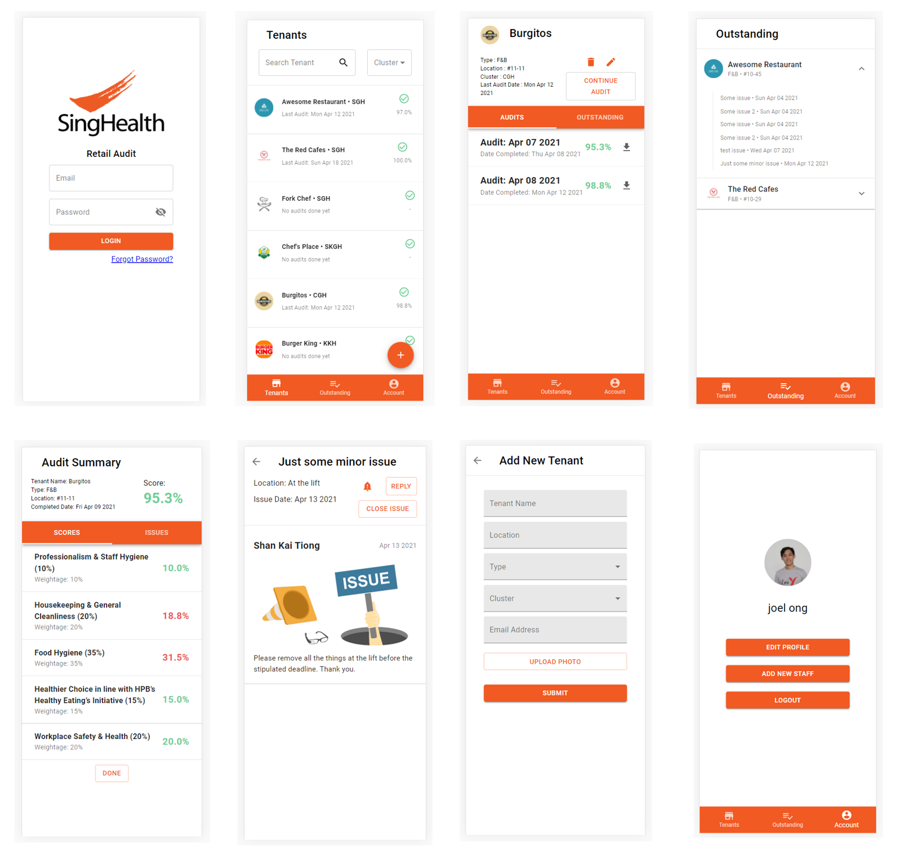

# 50.003 Elements of Software Construction Project

## SingHealth Retail Audit Application

### Team Members:

Tiong Shan Kai  
Amrish Sandhu  
Joel Ong  
Phan Vu Lan

### Project Description

A full stack application made using Node, Express, React and MySQL to digitalise audits for SingHealth.
UI was created using Material UI.

### Screenshots

